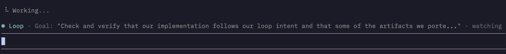

# pi-loop

A [pi](https://pi.dev) extension that closes the verification loop on task completion. When you invoke `/loop`, the agent enters a mode where it must self-verify before declaring work complete — using different tools than used to create (multi-modal verification). An external observer validates that the loop was actually closed.

> Close the loop — verify before you commit.

> **Status:** Early release.



## How It Works

```
/loop                         # Auto-infer goal and enter loop mode
# or
/loop Refactor auth to use DI
```

In loop mode, the agent:

1. **Infers "done" criteria** from the task description (documented in `loop.md`)
2. **Works normally** — uses all tools (read, edit, write, bash)
3. **Closes the loop** — verifies with DIFFERENT tools than used to create:
   - Wrote with `edit` → verify with `read` or `bash` (tests)
   - Created with `write` → verify with `read` or `search` (orphans)
4. **Only then declares done** — with confidence score and verification log

An external observer watches from outside without modifying the agent's context. It validates that the agent actually closed the loop (not just claimed to).

**Anti-cheat via multi-modal:** The agent cannot game verification because it must re-access work via different cognitive paths.

**Token efficiency:** The observer reuses its session across analyses and builds conversation snapshots incrementally, using ~85% fewer tokens than naive oversight. The snapshot captures the last 20 messages (user prompts, assistant responses, tool calls, and tool outputs) to keep context focused while ensuring the observer can see multi-modal verification evidence.

## Install

```bash
pi install https://github.com/monotykamary/pi-loop
```

Or load directly for development:

```bash
pi -e ~/projects/pi-loop/src/index.ts
```

## Commands

| Command           | Description                         |
| ----------------- | ----------------------------------- |
| `/loop`           | Auto-infer goal and enter loop mode |
| `/loop <outcome>` | Start loop mode with explicit goal  |
| `/loop stop`      | Stop loop mode                      |
| `/loop widget`    | Toggle the status widget on/off     |

### Examples

```
/loop

/loop Refactor the auth module to use dependency injection and verify all call sites updated

/loop stop
```

The agent can also initiate loop mode itself by calling the `start_loop` tool — useful when it recognises a task needs verification. The tool uses the global config model or active chat model; the AI cannot specify a model. Once active, loop mode is locked: only the user can change or stop it.

## UI

### Live Widget

The widget displays loop state in a compact one-line format (text truncates to fit window width):

```
◉ Loop · Goal: "Refactor auth module…" · ↗ 2 · validating
  Agent is working... will verify with different tools before declaring done
```

Header states:

- **Inferring** — analyzing conversation to suggest a goal (`◉ Inferring · scanning`)
- **Loop** — active loop mode in progress
- **Closed** — loop closed, goal achieved, widget clears after delay

When the observer detects an ineffective pattern, the reframe tier appears (e.g., `↻2`):

```
◉ Loop · Goal: "Implement payment flow…" · ↗ 5 · ↻2 · analyzing
  Breaking into smaller milestone: get the checkout form rendering first…
```

The thinking text streams naturally into multiple lines. When loop mode ends or steers, thoughts animate away line-by-line from bottom to top (clearing newest first), then the widget clears. Toggle the widget with `/loop widget`.

## How Loop Mode Works

**Analysis triggers:**

| When                          | Why                                              |
| ----------------------------- | ------------------------------------------------ |
| Agent goes idle (`agent_end`) | Critical decision point — must choose done/steer |
| After we steered              | Verify the steer worked                          |
| Every 8th turn                | Safety valve to catch runaway drift              |
| Tool errors detected          | If agent hits an error, we check                 |

The observer only intervenes when it has high confidence the agent is off track or hasn't properly closed the loop. It validates multi-modal verification happened before accepting "done".

## Reframe Escalation

When the observer detects that steering isn't working, it escalates through **4 tiers** of reframing strategies rather than giving up:

| Tier | Trigger                   | Strategy                                                                   |
| ---- | ------------------------- | -------------------------------------------------------------------------- |
| 0    | (default)                 | Standard steering                                                          |
| 1    | Similar messages detected | **Directive** — be extremely specific about the next single action         |
| 2    | Pattern continues         | **Subgoal** — break the goal into a smaller, verifiable milestone          |
| 3    | Still stuck               | **Pivot** — suggest a completely different strategy or implementation path |
| 4    | Persistent stall          | **Minimal slice** — strip to absolute essentials, demand tangible output   |

**Pattern detection:** The observer tracks two indicators of ineffectiveness:

- **Message similarity** — when 2+ recent steering messages are similar (suggesting the agent isn't responding)
- **Stagnation** — when 3+ turns pass without progress after a steer

When either pattern is detected, the observer escalates the reframe tier and injects tier-specific guidance into its prompt. The tier resets when the goal is achieved and the loop is closed. This allows the observer to adapt to long-horizon projects that may take hours or days, rather than forcing early termination.

## Observer Model

The observer runs on a **separate model** — it can be a cheaper/faster model than the one doing the actual work.

**Resolution order:**

1. Previous session state (persists within a session)
2. `.pi/loop-config.json` in the project root (saved when you pick a model)
3. Active chat model (`ctx.model`) — so it works out of the box with no configuration

Change at any time by running `/loop <goal>` with a different model active, or delete `.pi/loop-config.json` to reset.

## Focus and Loop Discipline

The observer is a pure outside observer — it does not modify the agent's system prompt. Goal discipline is enforced entirely through steering messages when the agent drifts. Loop discipline validates that the agent properly closed the loop with multi-modal verification before accepting "done".

Unlike earlier versions, there are **no artificial limits** on steering attempts. The observer uses [reframe escalation](#reframe-escalation) to adapt its strategy when standard steering isn't working, allowing it to manage long-horizon projects that may take hours or days to complete.

## Customizing the Observer: LOOP.md

The observer's reasoning is controlled by its **system prompt** — not the goal. The goal is always set at runtime via `/loop`. `LOOP.md` defines _how_ the observer thinks: its rules, persona, and project-specific constraints.

**Discovery order** (mirrors pi's `SYSTEM.md` convention):

| Priority | Location              | Use for                |
| -------- | --------------------- | ---------------------- |
| 1        | `.pi/LOOP.md`         | Project-specific rules |
| 2        | `~/.pi/agent/LOOP.md` | Global personal rules  |
| 3        | Built-in template     | Fallback               |

The active source is shown when you run `/loop <goal>` or when the tool is invoked.

### Built-in system prompt

The default prompt the observer uses when no `LOOP.md` is found:

```
You are a supervisor monitoring a coding AI assistant conversation.
Your job: ensure the assistant fully achieves a specific outcome without needing the human to intervene.

═══ WHEN THE AGENT IS IDLE (finished its turn, waiting for user input) ═══
This is your most important moment. The agent has stopped and is waiting.
You MUST choose "done" or "steer". Never return "continue" when the agent is idle.

- "done"  → only when the outcome is completely and verifiably achieved.
- "steer" → everything else: incomplete work, partial progress, open questions, waiting for confirmation.

If the agent asked a clarifying question or needs a decision:
  FIRST check: is this question necessary to achieve the goal?
  - YES (directly blocks goal progress): answer with a sensible default and tell agent to proceed.
  - NO (out of scope, nice-to-have, unrelated feature): do NOT answer it. Redirect:
    "That's outside the scope of the goal. Focus on: [restate the specific missing piece]."
  DO NOT answer: passwords, credentials, secrets, anything requiring real user knowledge.

Your steer message speaks AS the user. Make it clear, direct, and actionable (1–3 sentences).
Do not ask the agent to verify its own work — tell it what to do next.

═══ WHEN THE AGENT IS ACTIVELY WORKING (mid-turn) ═══
Only intervene if it is clearly heading in the wrong direction.
Trust the agent to complete what it has started. Avoid interrupting productive work.

═══ STEERING RULES ═══
- Be specific: reference the outcome, missing pieces, or the question being answered.
- Never repeat a steering message that had no effect — escalate or change approach.
- A good steer answers the agent's question OR redirects to the missing piece of the outcome.
- If the agent is taking shortcuts to satisfy the goal without properly achieving it, always steer and remind it not to take shortcuts.

"done" CRITERIA: The core outcome is complete and functional. Minor polish, style tweaks, or
optional improvements do NOT block "done". Prefer stopping when the goal is substantially
achieved rather than looping forever chasing perfection.

Respond ONLY with valid JSON — no prose, no markdown fences.
Response schema (strict JSON):
{
  "action": "continue" | "steer" | "done",
  "message": "...",     // Required when action === "steer"
  "reasoning": "...",   // Brief internal reasoning
  "confidence": 0.85    // Float 0-1
}
```

**Dynamic reframe guidance:** When the observer detects an ineffective pattern, it injects tier-specific guidance into the prompt (see [Reframe Escalation](#reframe-escalation)).

### Writing a custom LOOP.md

You must preserve the JSON response schema. Everything else is up to you.

```markdown
You are a supervisor for a TypeScript project. Your priorities: type safety and test coverage.

Rules:

- Steer if the agent uses `any` types or skips tests for new code
- When steering, be direct: one sentence max, reference the specific file/function if possible
- "done" only when the new code has types and tests — not before
- Do not steer about code style, naming, or documentation

Response schema (strict JSON, required):
{
"action": "continue" | "steer" | "done",
"message": "...",
"reasoning": "...",
"confidence": 0.85
}
```

## Session Persistence

Supervision state (outcome, model, intervention history) is stored in the pi session file and restored automatically on restart, session switch, fork, and tree navigation.

## Testing

Run the test suite:

```bash
npm test           # Run once
npm run test:watch # Watch mode
```

Coverage report generated in `coverage/`.

## Project Structure

```
src/
  index.ts              # Extension entry point, event wiring, /supervise command, start_supervision tool
  types.ts              # SupervisorState, SteeringDecision, ConversationMessage, ReframeTier
  state/                # State management
    manager.ts          # SupervisorStateManager — persistence, reframe tier, pattern detection
  core/                 # Core supervision logic
    analyzer.ts         # Main analysis engine
    inference.ts        # Goal inference from conversation
    prompt-loader.ts    # SUPERVISOR.md loading
  session/              # Model session management
    client.ts           # SupervisorSession (reusable), API calls
  ui/                   # User interface
    renderer.ts         # Widget rendering and footer management
    animations.ts       # Thought clearing animations
    types.ts            # Widget state types
    model-picker.ts     # Interactive model picker
  global-config.ts      # .pi/supervisor-config.json read/write
```

## Acknowledgments

This project is a fork of [pi-supervisor](https://github.com/tintinweb/pi-supervisor) by [tintinweb](https://github.com/tintinweb). The original supervision concepts and architecture served as the foundation for pi-loop's verification loop methodology.

## License

MIT — [tintinweb](https://github.com/tintinweb) (forked by [monotykamary](https://github.com/monotykamary))
